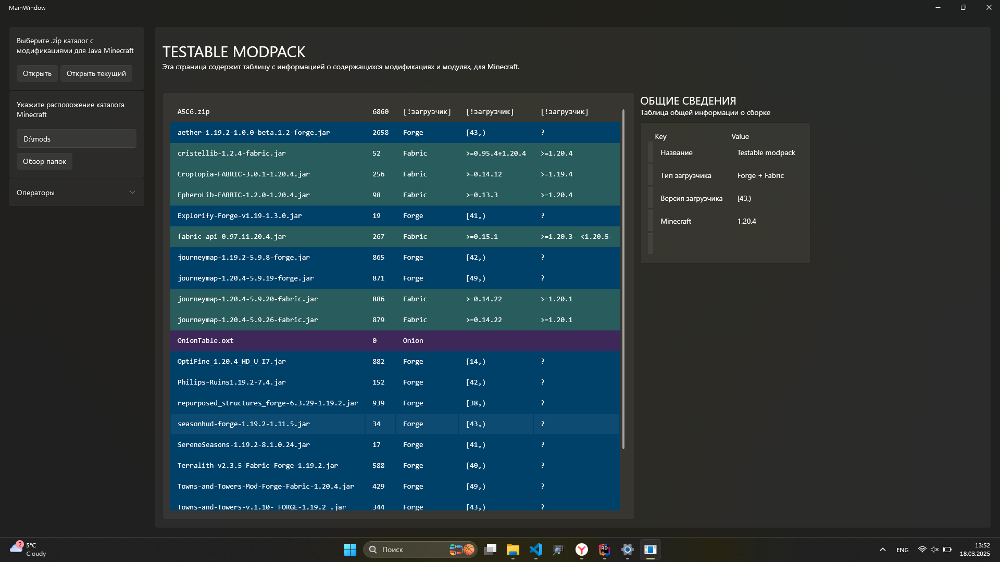

# Onion
Reborn of [ModMover](https://github.com/AlexeyTolstopyatov/modmover-winforms) - Java-Minecraft Modification manager.
Incapsulates all modpacks or mod-buildings in archives and stores for future use.
Select archive or mods directory, double click and run Minecraft with your favourite modifications from Onion. 

### Frameworks
 - WPF-UI
 - .NET 6.0
